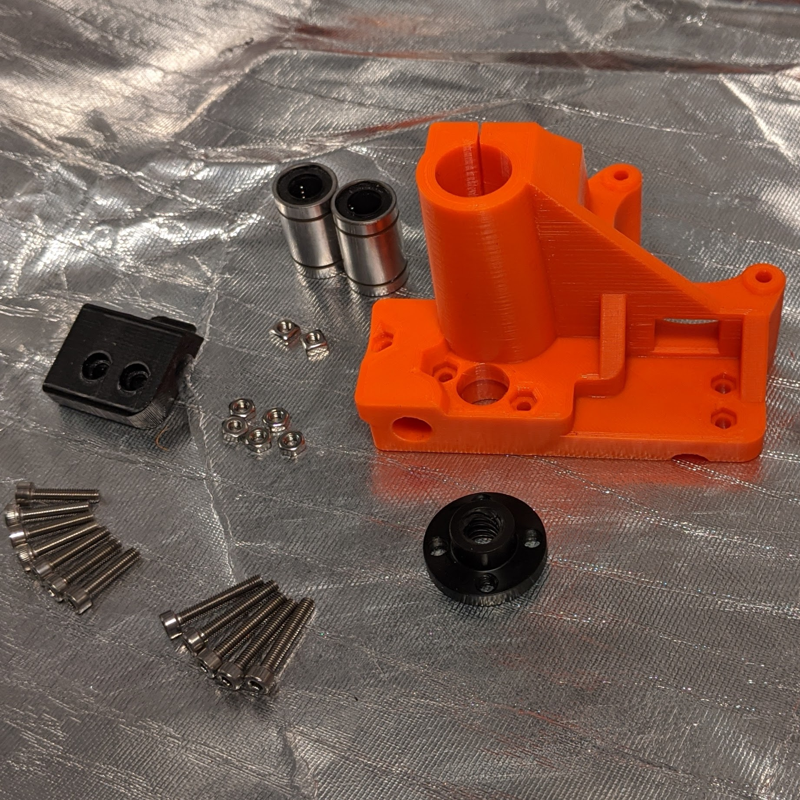
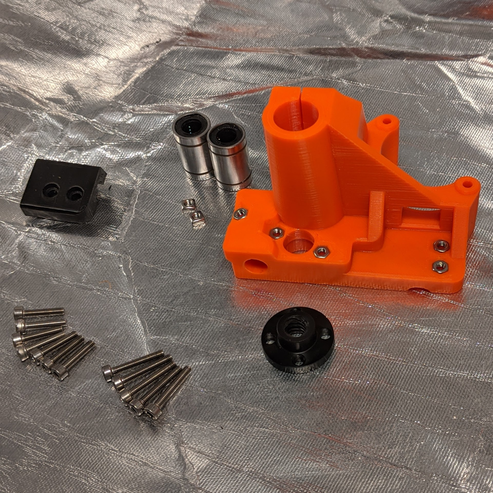
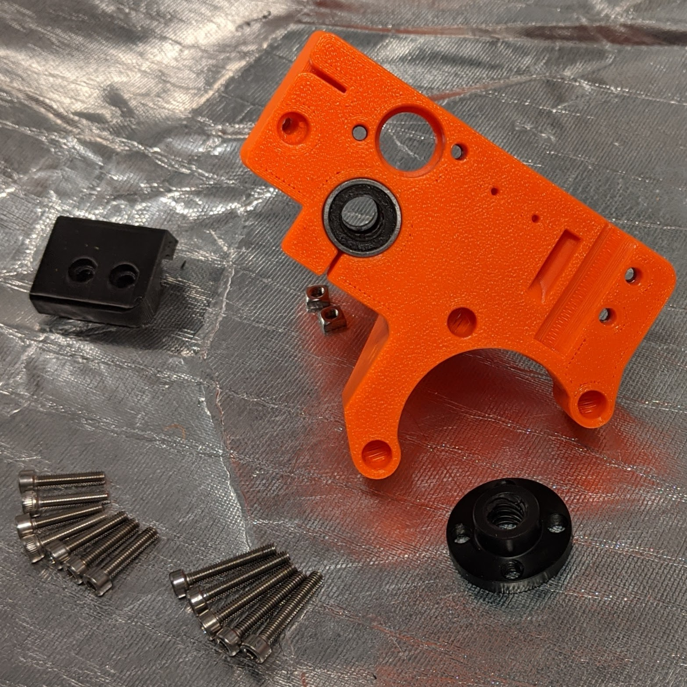
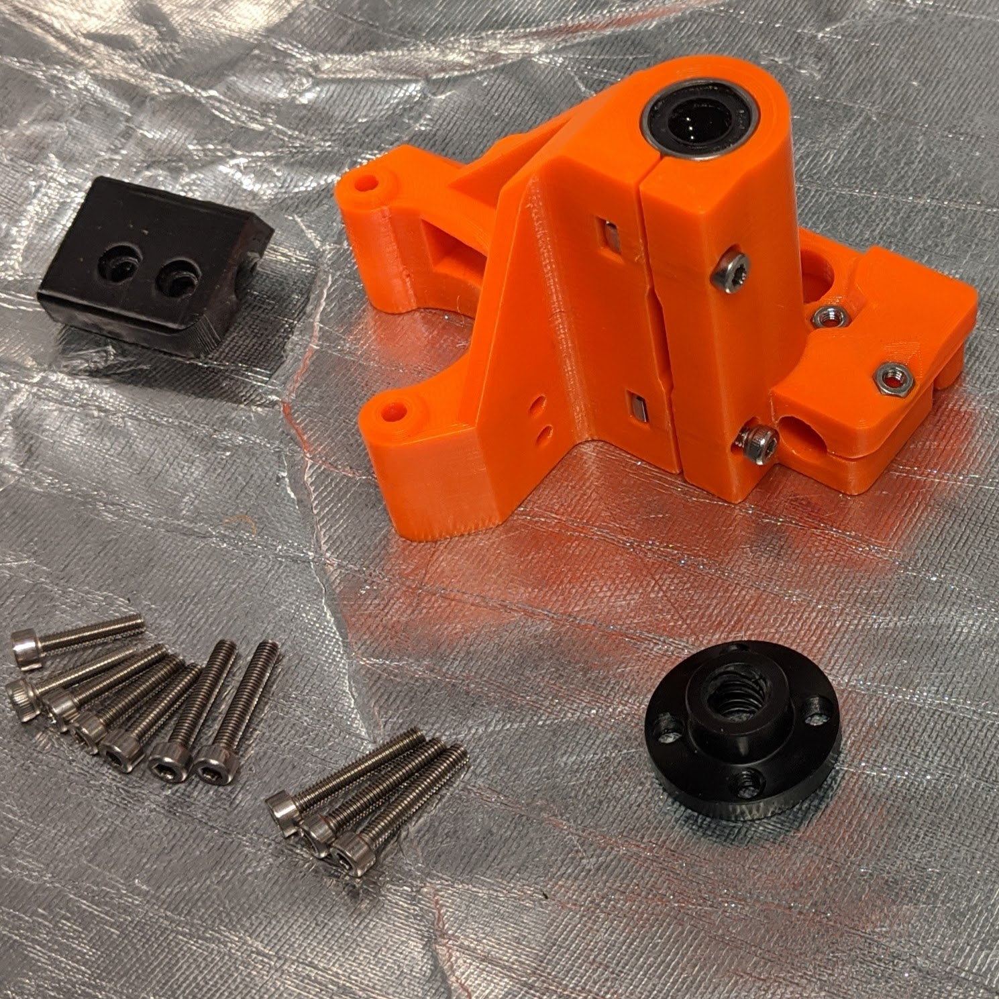
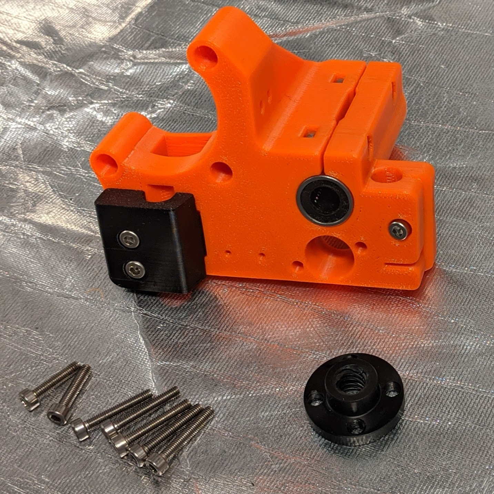
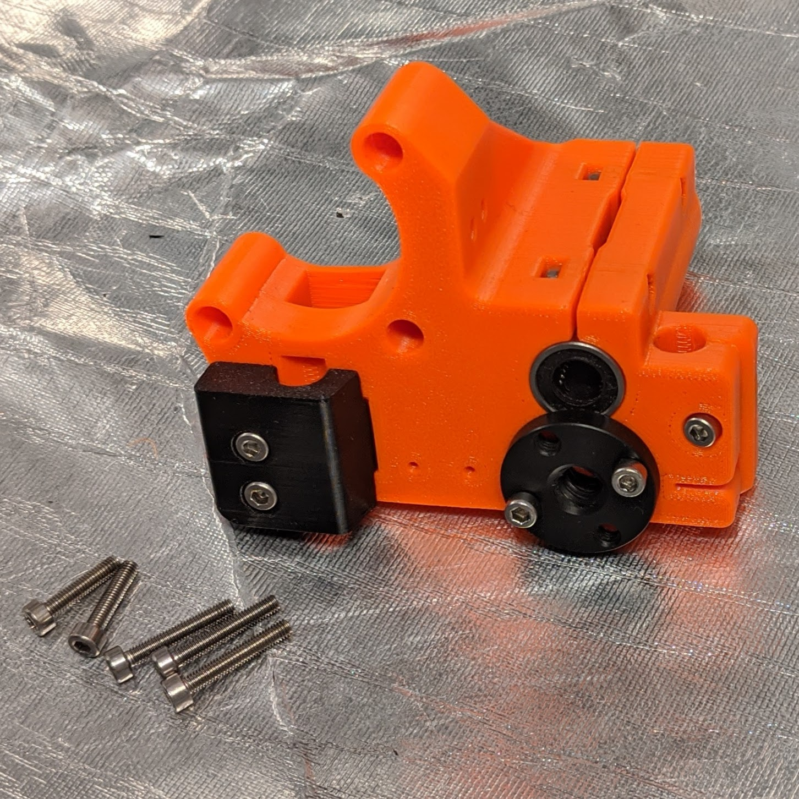
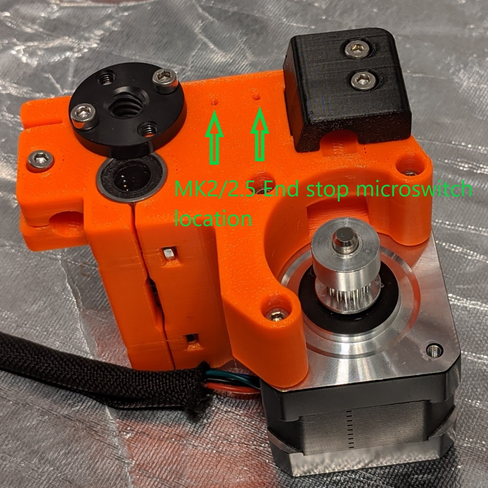

[Previous](00_First.md) | [Next](02_Part_Right.md)  
---
# Part Left  
### #hemeraodyssey
---
# Parts  
|Quantity|Size|Type|
|---:|:---:|:---:|
|1|[**HemeraOdyssey-Part_Left_Motor.stl**](../HemeraOdyssey_STLs_BETA/HemeraOdyssey-Part_Left_Motor.stl)|Printed Part|
|1|[**HemeraOdyssey-Part_Left_Front_Rod_Clamp.stl**](../HemeraOdyssey_STLs_BETA/HemeraOdyssey-Part_Left_Front_Rod_Clamp.stl)|Printed Part|
|2|10mm|M3(Not needed yet)|
|5|14mm|M3 Bolt|
|5|18mm|M3 Bolt|
|5|M3|Hex Nut|
|2|M3|Square Nut|
|1|POM Trapezoidal Nut|T8|
|2|LM8UU|Bearing|  
---
### 01
* Puncture the back rod clamp hole using the M3 hex driver due to the bridging support  
* Insert a smooth rod into the back clamp to break the support then clear out the support material carefully using a knife or thin metal ruler.     

---
### 02
* Insert all 5x hex nuts using a 14mm bolt from the rear   

---
### 03
* Insert both LM8UU bearings in X configuration (looking down from front & above) for both   

---
### 04
* Insert 2 square nuts  
* Insert 2 14mm bolts to secure, don't over tighten   

---
### 05
* Loosely fit the front clamp part with 2x 14mm bolt and loosely insert 1x 14mm bolt in the rear clamp   

---
### 06
* Loosely fit the POM Trapezoidal Nut using 2x 18mm bolts   

---
### 07
* Puncture the 3x motor holes using the M3 hex driver due to the bridging support   

---
### 08
* Secure the motor with 3x 18mm bolts
* For MK2/MK2.5 secure the endstop microswitch using 2x M2 12mm   

---
[Previous](00_First.md) | [Next](02_Part_Right.md)