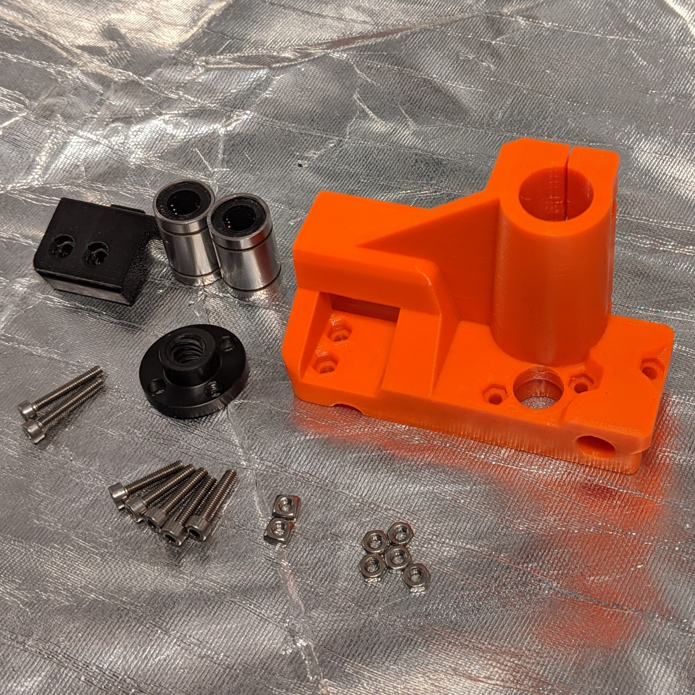
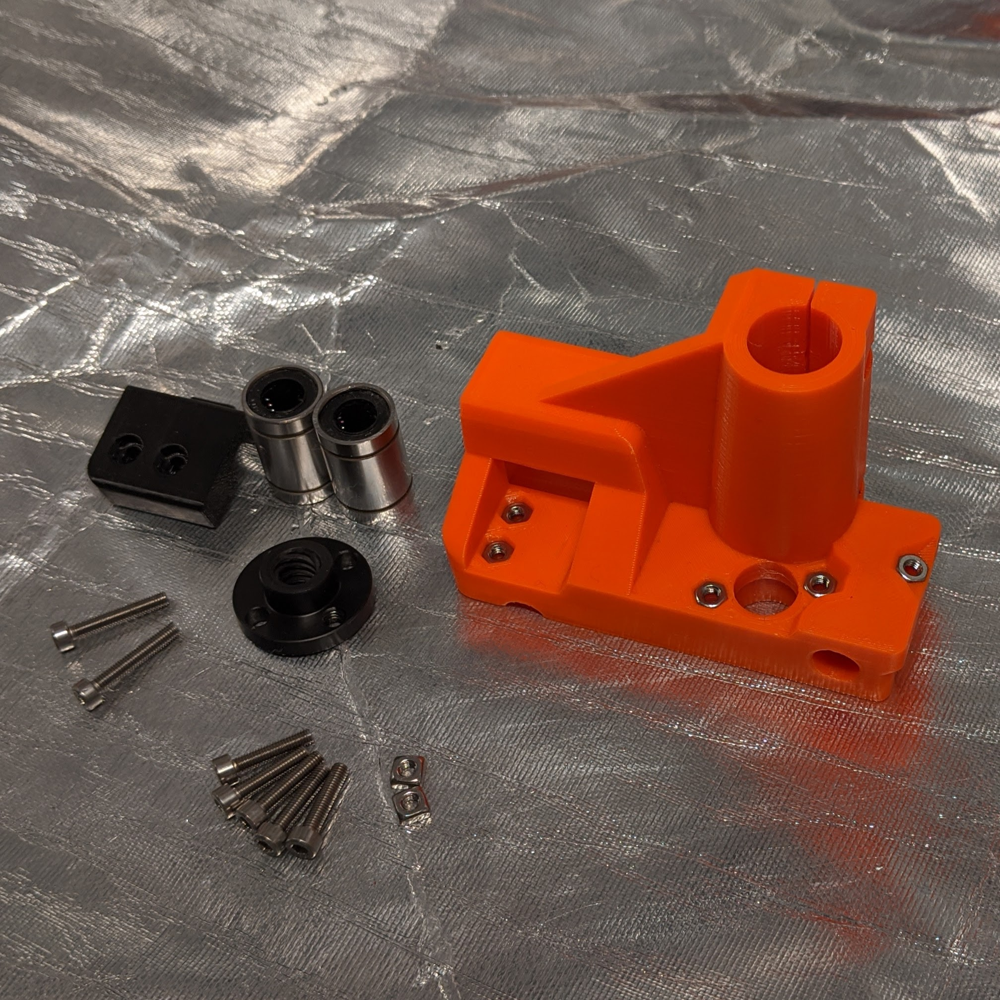
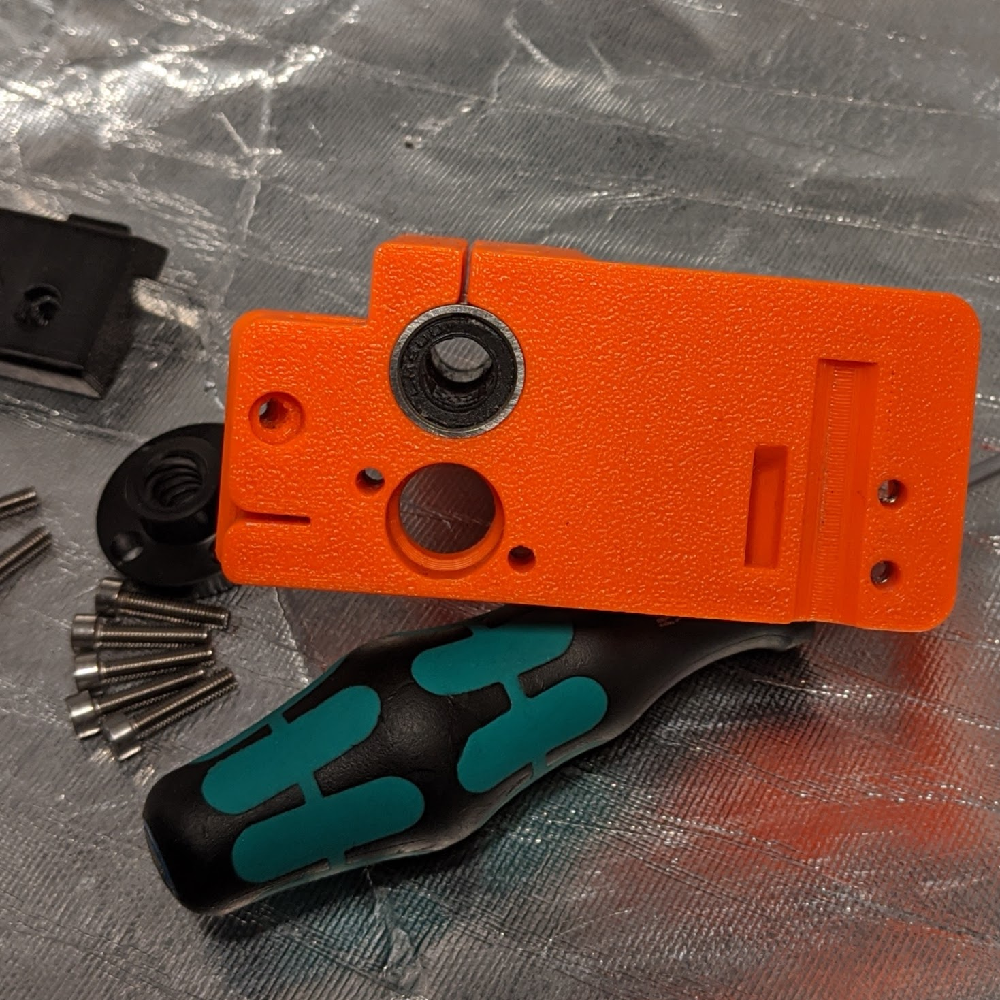
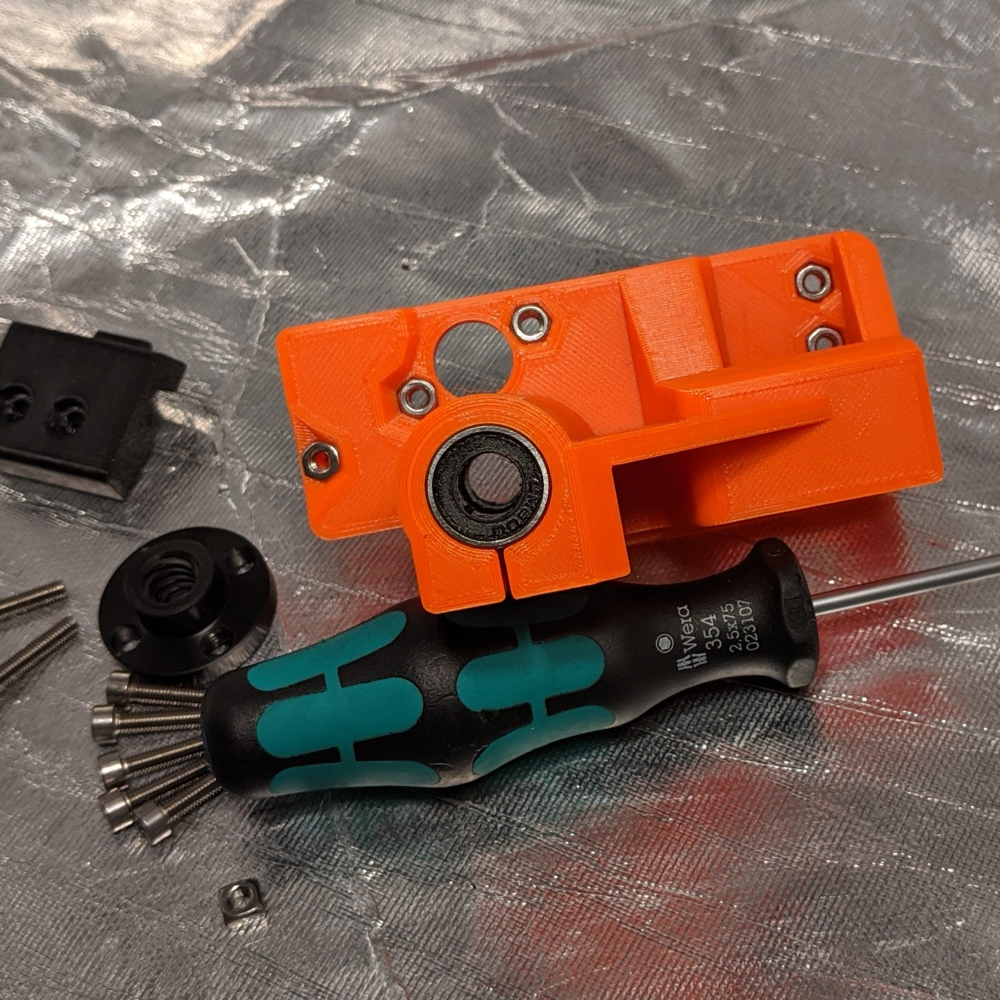
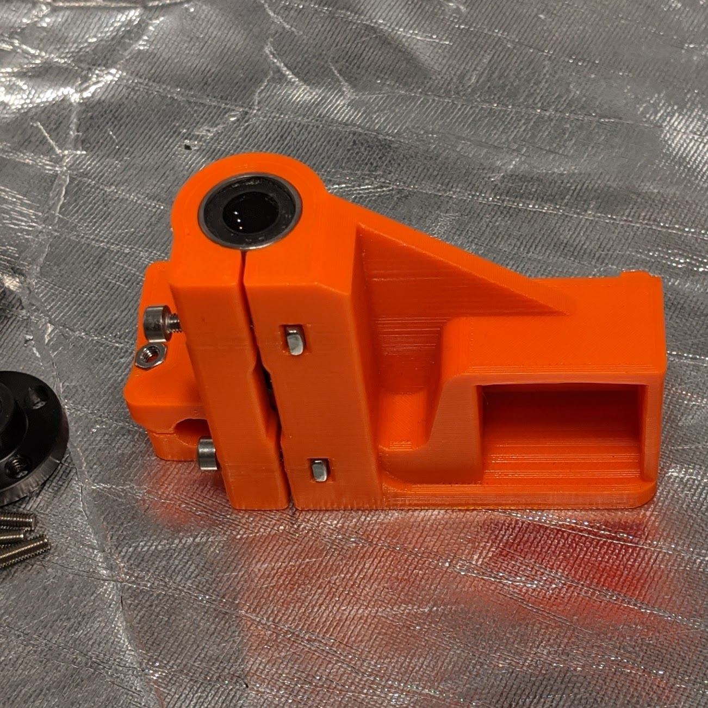
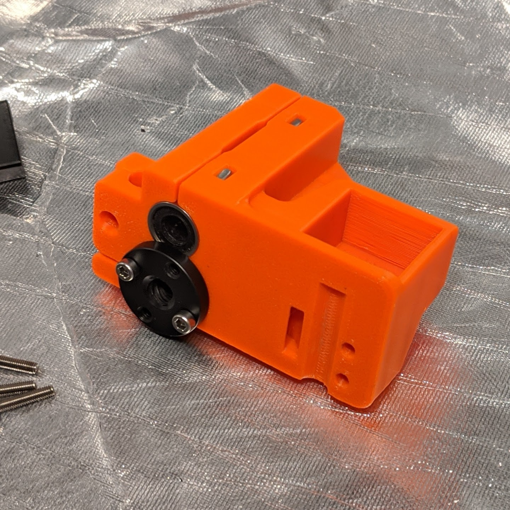
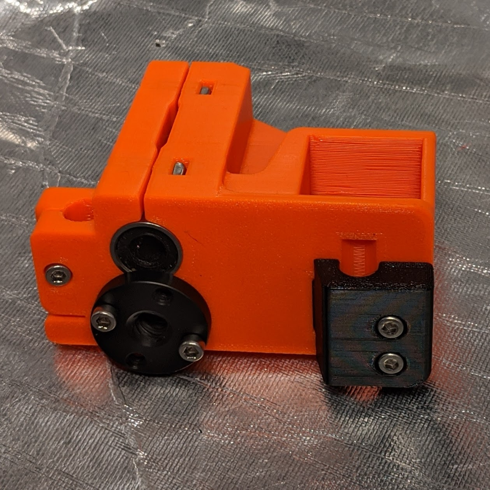

[Previous](01_Part_Left.md) | [Next](03_Idler.md)
### #hemeraodyssey
---
# Part Right
---
# Parts  
|Quantity|Size|Type|
|---:|:---:|:---:|
|1|[**Part_Right_Idler.stl**](../HemeraOdyssey_STLs_BETA/HemeraOdyssey-Part_Right_Idler.stl)|Printed Part|
|1|[**Part_Right_Front_Rod_Clamp.stl**](../HemeraOdyssey_STLs_BETA/HemeraOdyssey-Part_Right_Front_Rod_Clamp.stl)|Printed Part|
|5|14mm|M3 Bolt|
|2|18mm|M3 Bolt|
|5|M3|Hex Nut|
|2|M3|Square Nut|
|1|T8|POM Trapezoidal Nut|
|2|LM8UU|Bearing|  
---
* Snap off brim support
* Puncture the back rod clamp hole using the M3 hex driver due to bridging support    

---
* Insert all 5 hex nuts using a 14mm bolt from the rear   

---
* Insert both LM8UU bearings in X configuration (looking down from front & above) for both   

---
* Insert 2 square nuts  
* Insert 2 14mm bolts to secure, don't over tighten   

---
* Loosely fit the POM Trapezoidal Nut using 2 18mm bolts   

---
* Puncture the 3 motor holes using the M3 hex driver due to bridging support    

---
[Previous](01_Part_Left.md) | [Next](03_Idler.md) 