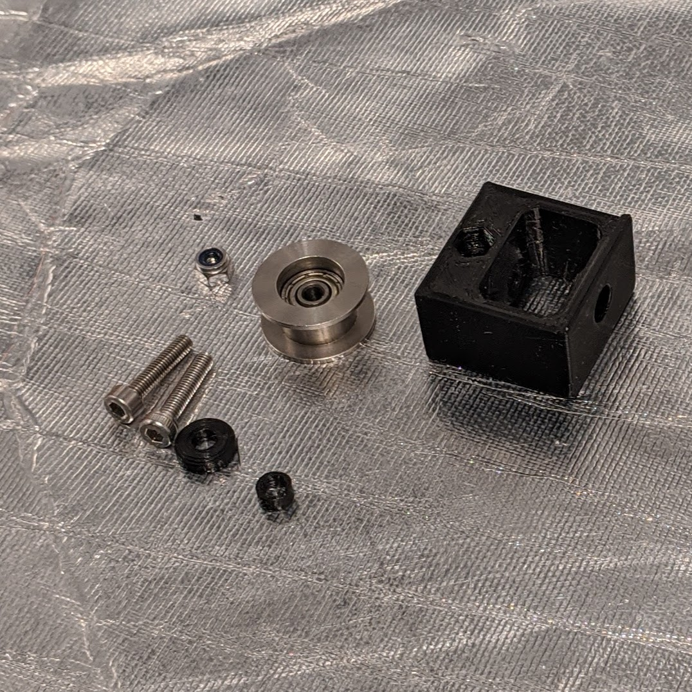
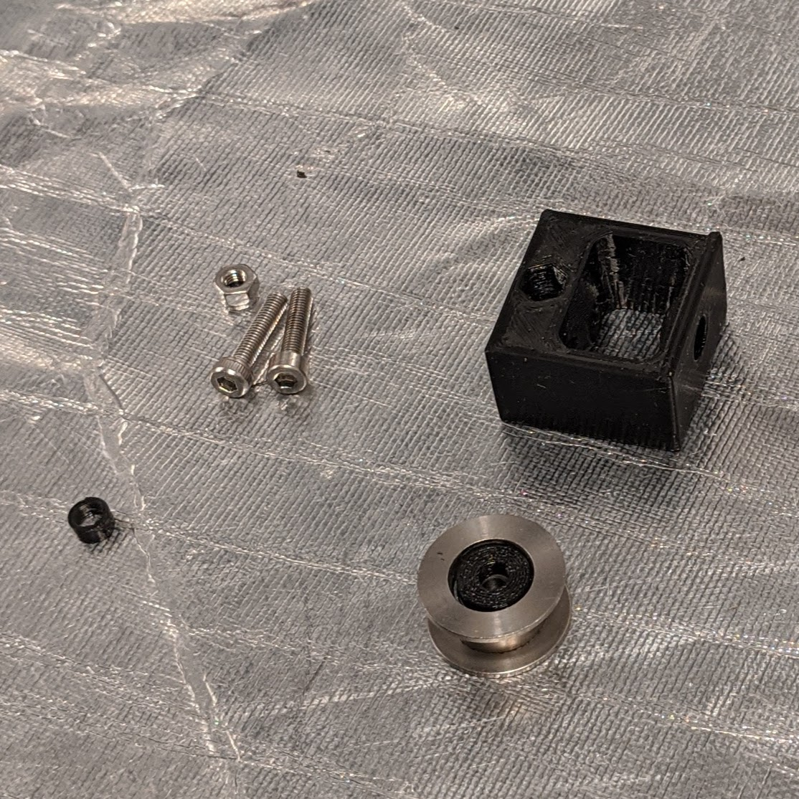
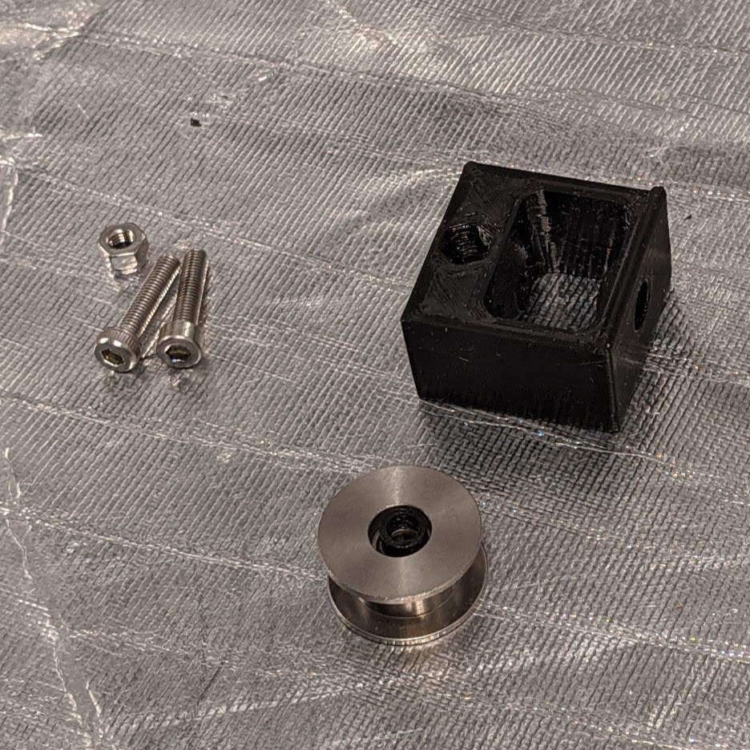
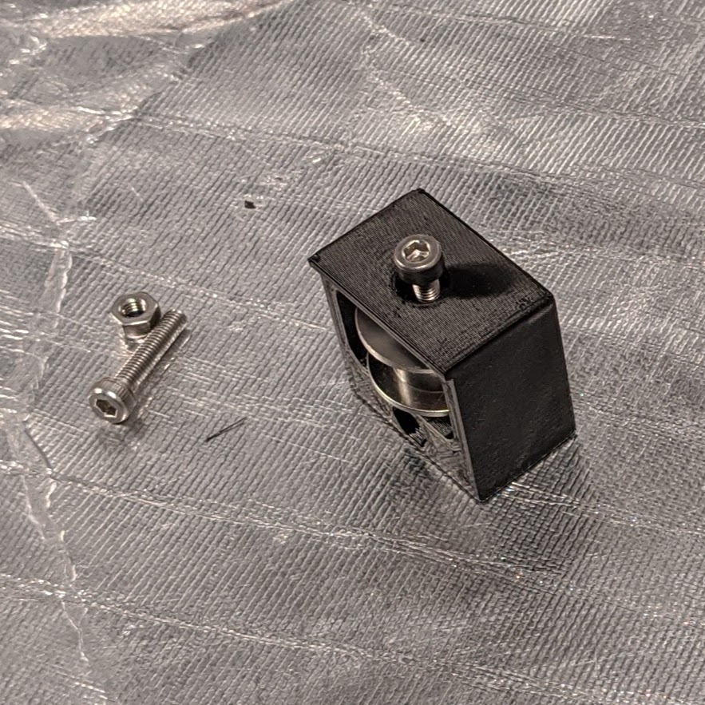
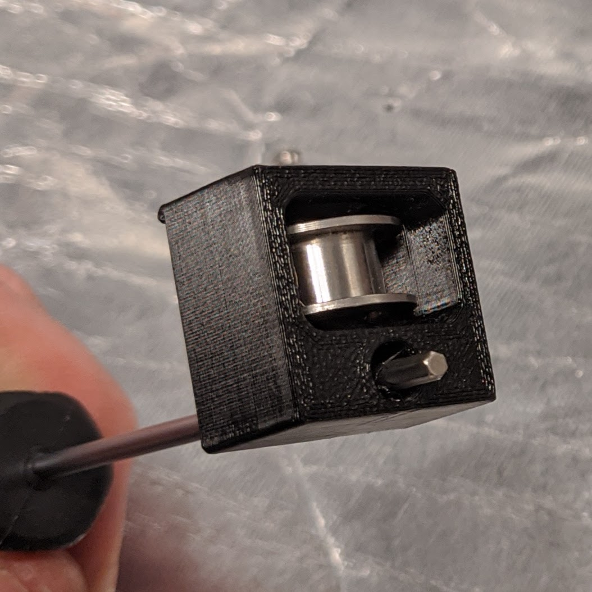
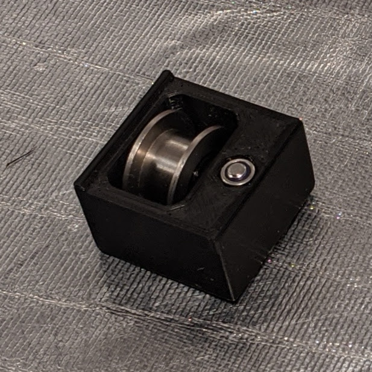
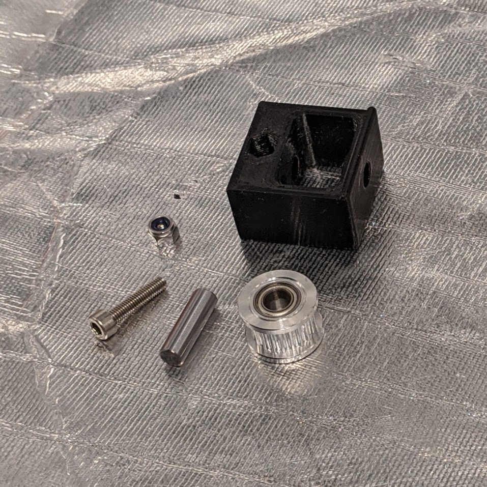
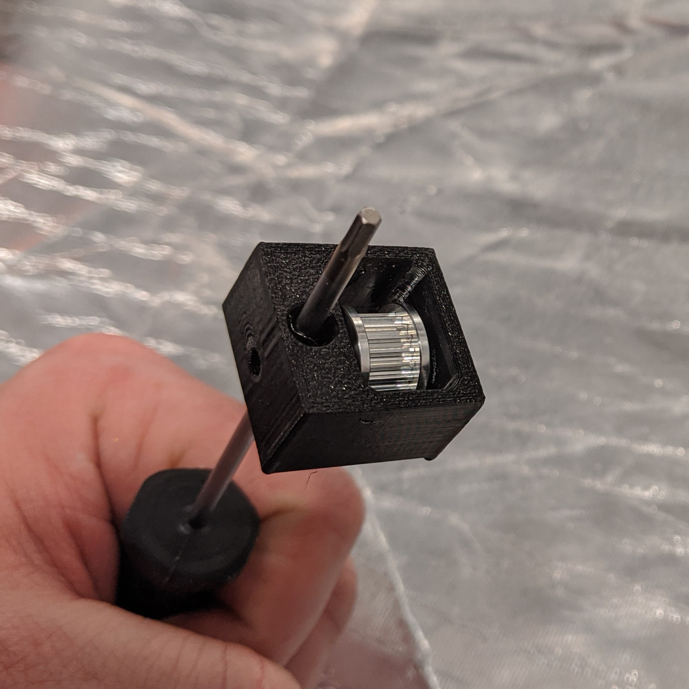
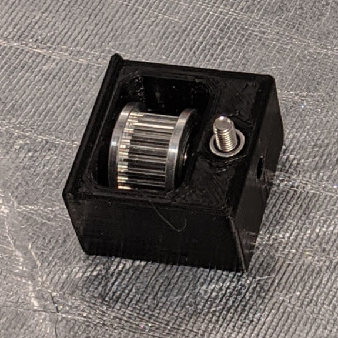

[Previous](02_Part_Right.md) | [Next](04_X_Carriage.md)
### #hemeraodyssey
---
# Idler
---
# Parts Stock
|Quantity|Size|Type|
|---:|:---:|:---:|
|1|[**HemeraOdyssey-Idler_Housing_Prusa_20T_3mmID.stl**](../HemeraOdyssey_STLs_BETA/HemeraOdyssey-Idler_Housing_Prusa_20T_3mmID.stl)|Printed Part|
|1|[**HemeraOdyssey-Idler_Housing_Prusa_20T_3mmID_Spacer_Top.stl**](../HemeraOdyssey_STLs_BETA/HemeraOdyssey-Idler_Housing_Prusa_20T_3mmID_Spacer_Top.stl)|Printed Part|
|1|[**HemeraOdyssey-Idler_Housing_Prusa_20T_3mmID_Spacer_Bottom.stl**](../HemeraOdyssey_STLs_BETA/HemeraOdyssey-Idler_Housing_Prusa_20T_3mmID_Spacer_Bottom.stl)|Printed Part|
|2|14mm|M3|
|1|Nylon Lock Nut|M3|
|1|Smooth T20|Prusa Idler|
---

---
* Place the Spacer_Bottom in the large hole   

---
* Place the Spacer_Top in the small hole   

---
* Insert the assembled idler into the idler housing
* Secure the idler with 1 14mm bolt encuring not to overtighten. This is going into plastic so take it slow   

---
* Puncture the adjuster hole due to bridging support   

---
* Insert the Nylon Lock Nut and secure using 1 14mm bolt, then unscrew until bolt end is flush.   

---
# Parts Gates
|Quantity|Size|Type|
|---:|:---:|:---:|
|1|[**HemeraOdyssey-Idler_Housing_Gates_20T_5mmID.stl**](../HemeraOdyssey_STLs_BETA/HemeraOdyssey-Idler_Housing_Gates_20T_5mmID.stl)|Printed Part|
|1|14mm-15.8mm|4.95mm OD Dowel for Gates Idler|
|2|14mm|M3|
|1|Nylon Lock Nut|M3|
|1|Toothed T20|Gates Idler|
---
* Insert the Gates idler and secure in place using the dowel   

---
* Puncture the adjuster hole due to bridging support   

---
* Insert the Nylon Lock Nut and secure using 1 14mm bolt, then unscrew until bolt end is flush. (Not like the picture, will update it soon)   

---
[Previous](02_Part_Right.md) | [Next](04_X_Carriage.md)