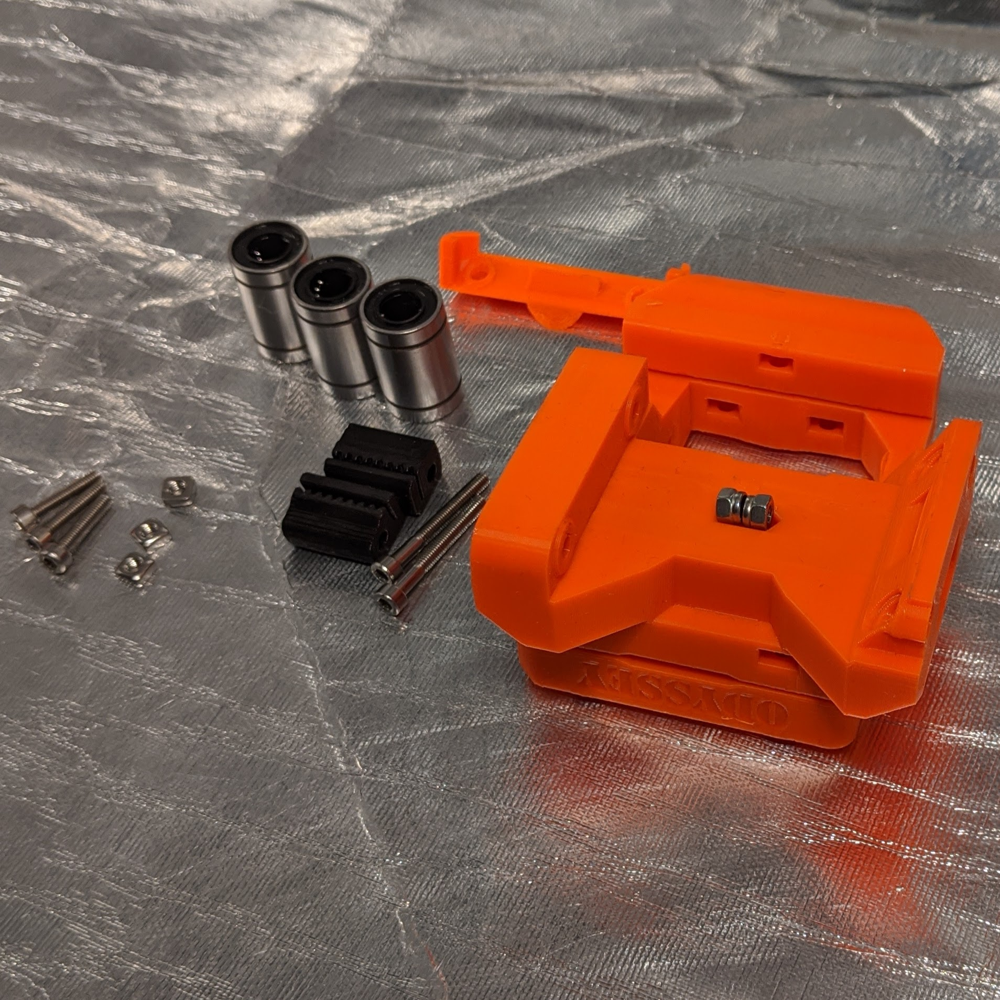
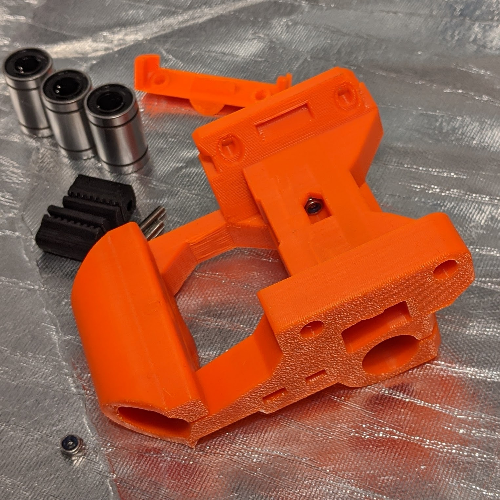
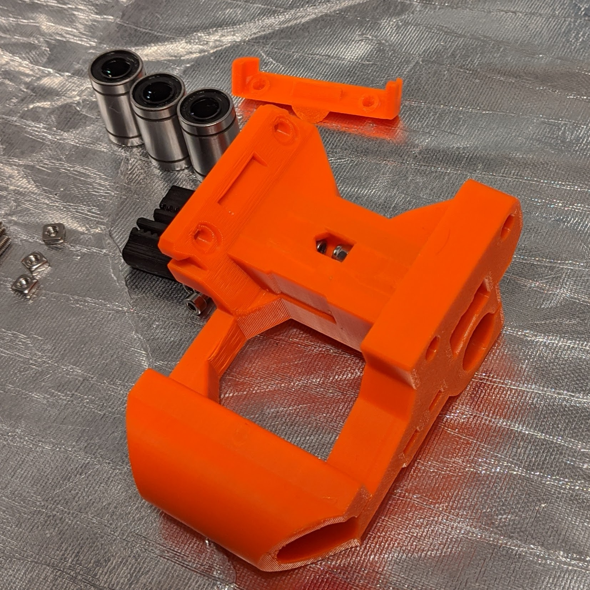
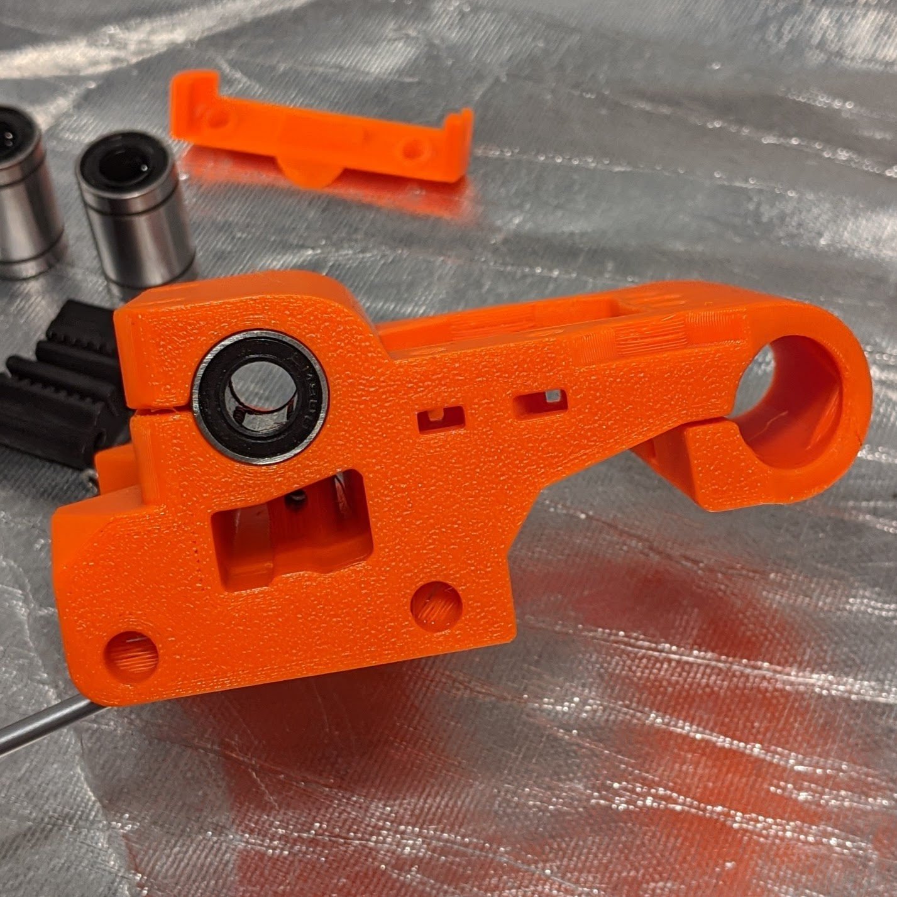
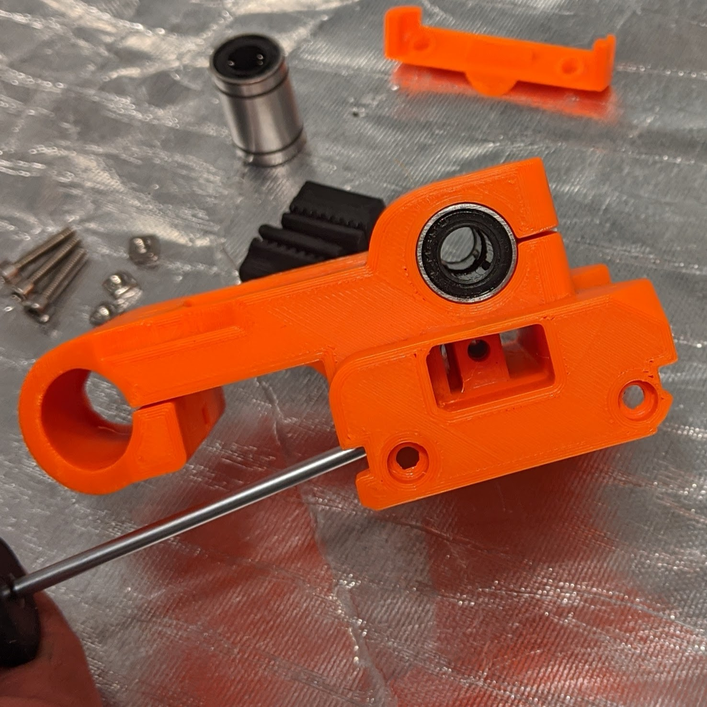
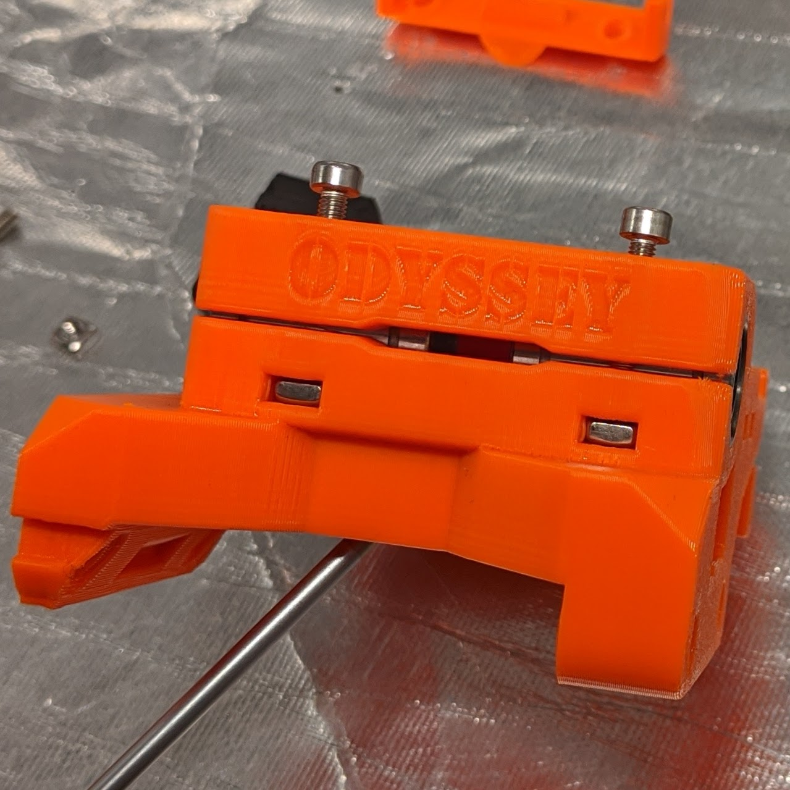
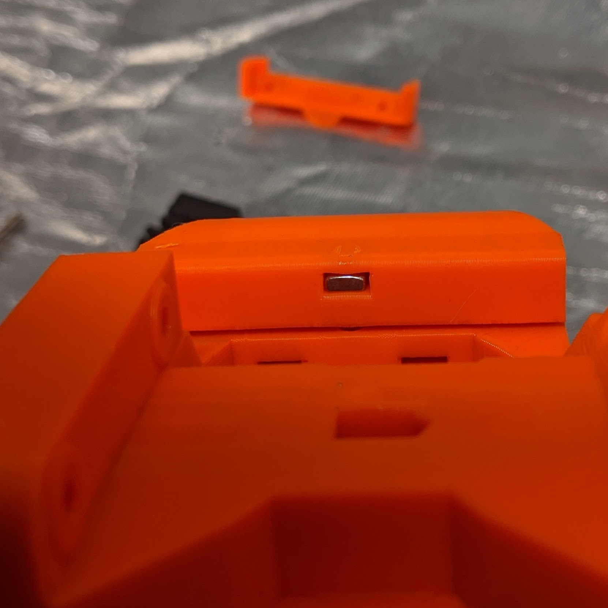

[Previous](03_Ider.md) | [Next](05_Filament_Sensor.md)
### #hemeraodyssey
---
# X Carriage
---
# Parts  
|Quantity|Size|Type|
|---:|:---:|:---:|
|1|[**HemeraOdyssey-X_Carriage.stl**](../HemeraOdyssey_STLs_BETA/HemeraOdyssey-X_Carriage.stl)|Printed Part|
|2|M3|Nylon Lock Nut|
|2|14mm|M3 Bolt|
|3|M3|Square Nut|
|3|LM8UU|Bearing| 
---
* Puncture the clamp holes and belt tensioner hole using the M3 hex driver due to bridging support
* Nylon Lock Nut orientation   

---
* Push down then back into the hole. Using a bolt can help engage the lock nut into place   

---
* Do the same for the other side    

---
* Insert both front LM8UU bearings in X configuration for both, so two rows of bearing sit on top when mounted   
 

---
* Insert rear LM8UU bearings in X configuratio, so two rows of bearing sit on top when mounted   

---
* Insert 2 square nuts  
* Insert 2 14mm bolts to secure, don't over tighten   

---
* Insert 1 square nuts   

---
* Insert 1 14mm bolts to secure, don't over tighten    

---
[Previous](03_Ider.md) | [Next](05_Filament_Sensor.md)