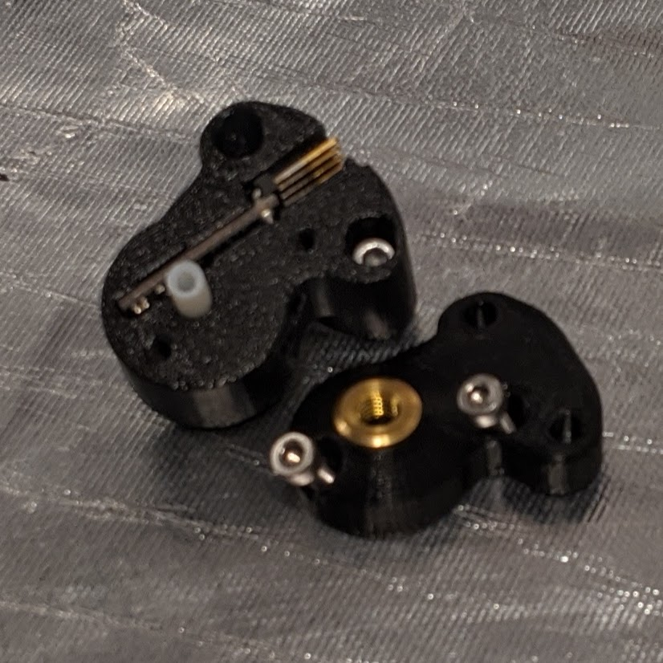

[Previous](04_X_Carriage.md) | [Next](06_Extruder_Assembly.md)
---
# Filament Sensor
---
# Parts  
|Quantity|Size|Type|
|---:|:---:|:---:|
|1|[**.stl**](../HemeraOdyssey_STLs_BETA/.stl)|Printed Part|
||mm|M3|
---
# IR Sensor   

---
*    

---
*    

---
*    

---
*    

---
*    

---
*    

---
# Laser Sensor   

---
*    

---
*    

---
*    

---
*    

---
*    

---
[Previous](01_Part_Left.md) | [Next](03_Idler.md)