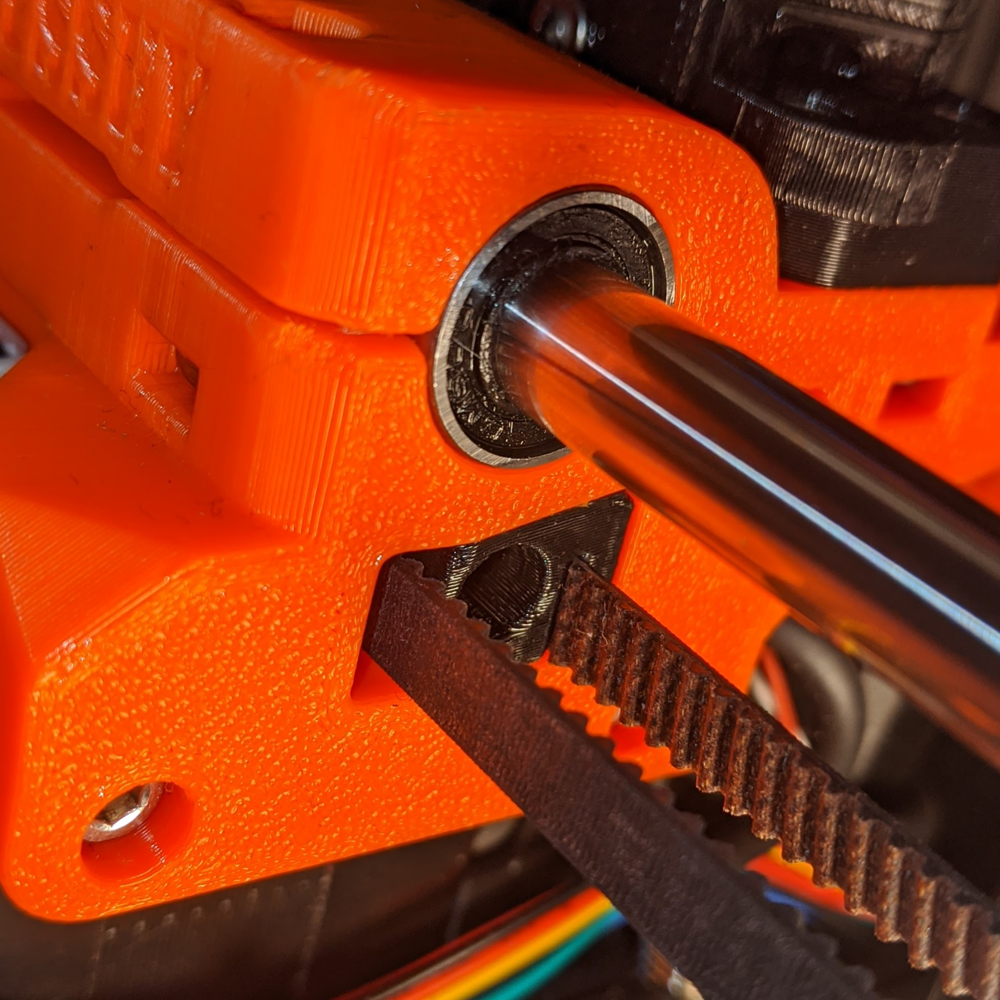

[Previous](07_Extruder.md)   
---
# Extruder
### #hemeraodyssey
---
# Parts  
|Quantity|Size|Type|
|---:|:---:|:---:|
|1|[**HemeraOdyssey-X_Carriage_Belt_Tensioner_Left.stl**](../HemeraOdyssey_STLs_BETA/HemeraOdyssey-X_Carriage_Belt_Tensioner_Left.stl)|Printed Part|
|1|[**HemeraOdyssey-X_Carriage_Belt_Tensioner_Right.stl**](../HemeraOdyssey_STLs_BETA/HemeraOdyssey-X_Carriage_Belt_Tensioner_Right.stl)|Printed Part|
|1|[**HemeraOdyssey-Z_Top_Left_7mm.stl**](../HemeraOdyssey_STLs_BETA/HemeraOdyssey-Z_Top_Left_7mm.stl)|Printed Part (MK3S Only)|
|1|[**HemeraOdyssey-Z_Top_Right_7mm.stl**](../HemeraOdyssey_STLs_BETA/HemeraOdyssey-Z_Top_Right_7mm.stl)|Printed Part (MK3S Only)|
||mm|M3|
---
### 01
*    

---
### 02
*    

---
### 03
* MK3S Only
* Use 4 12mm bolts to secure the Z Tops  

---
### 04
*    

---
### 05
*    

---
### 06
*    

---
### 07
*    

---
### 08
*    

---
### 09
* Use 1 25mm bolt to secure the belt clamp
* Fully tighten the bolt, this is **not** adjustable   

---
### 10
## Belt Tensioner  
* Use 1 25mm bolt to secure the belt clamp, adjust belt position as needed before tightening the bolt
* There is only 5mm travel, so ensure the belt is taut and not protruding the x carriage before tensioning the belt   

* Should looks like this after tensioning

---
### 11
* This is the Idler adjuster (**NOT** a belt tensioner). It is used to align the belt.
* Fine adjustments are required
* Looking from this angle, move the x carriage back and forth
* If the belt sits low, then tighten the screw
* If the belt sits high, then losen the screw
* It is normal for the belt to travel slightly up and down, especially on the stock Prusa idelr
* This may require adjusting the motor drive gear up or down to get perfect
* I recommend getting a Gates idler due to the dual bearing making it easier to align   

---
### 12
*    

---
[Previous](07_Extruder.md)